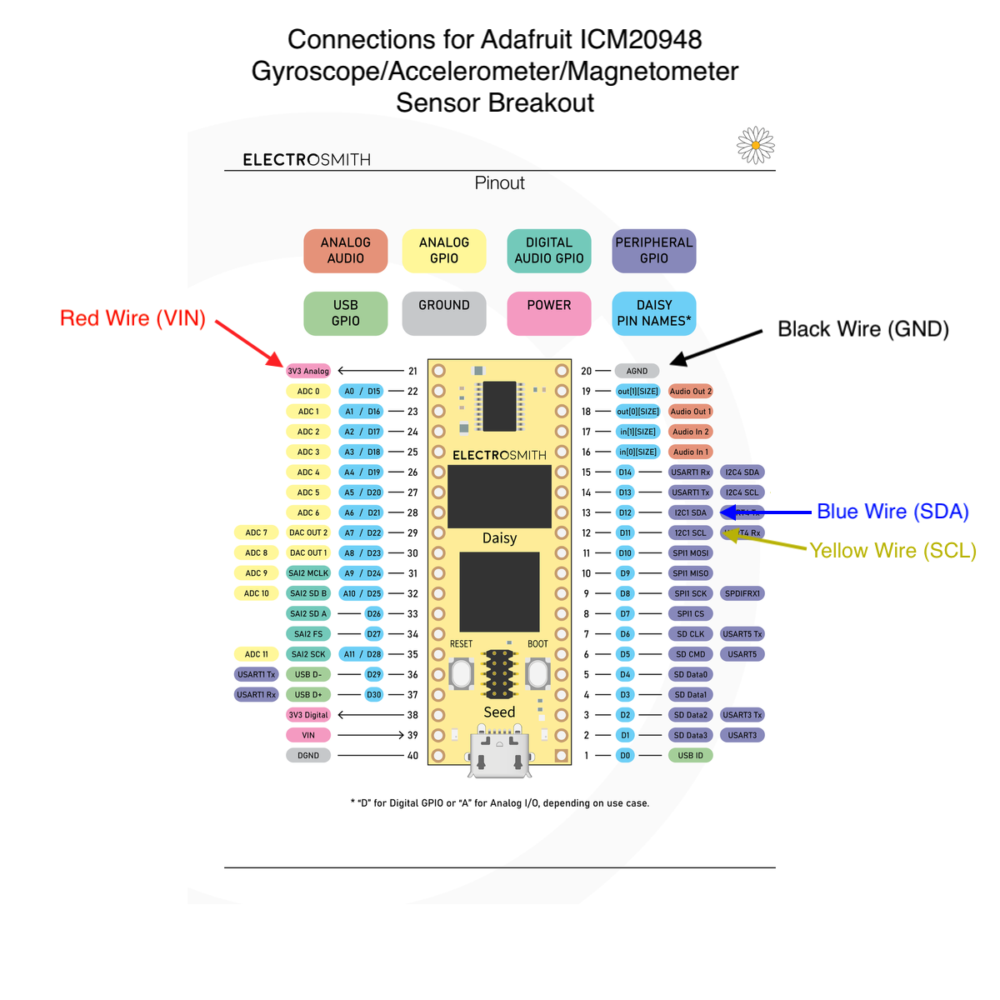

# Adafruit ICM20948 Accelerometer/Gyroscope/Magnetometer Template

This project uses an Adafruit ICM20948 breakout sensor module to read accelerometer, gyro, and
magnetometer data and provides an example of mapping the data to synthesis parameters.

## Installation

Install the Adafruit ICM20X library using the Arduino Library manager.

Copy the entire `synthux-2023-gyro-template` folder into your Arduino sketchbook directory.
This is usually found in `<your_system_documents_folder>/Arduino`.

Open the sketch in the Arduino IDE, either from the Sketchbook panel or using `File->Open`
and choosing the `.ino` file.

You'll need to have the [DaisyDuino](https://github.com/electro-smith/DaisyWiki/wiki/1a.-Getting-Started-(Arduino-Edition)) toolchain setup.

## Sensor Pin Connections

